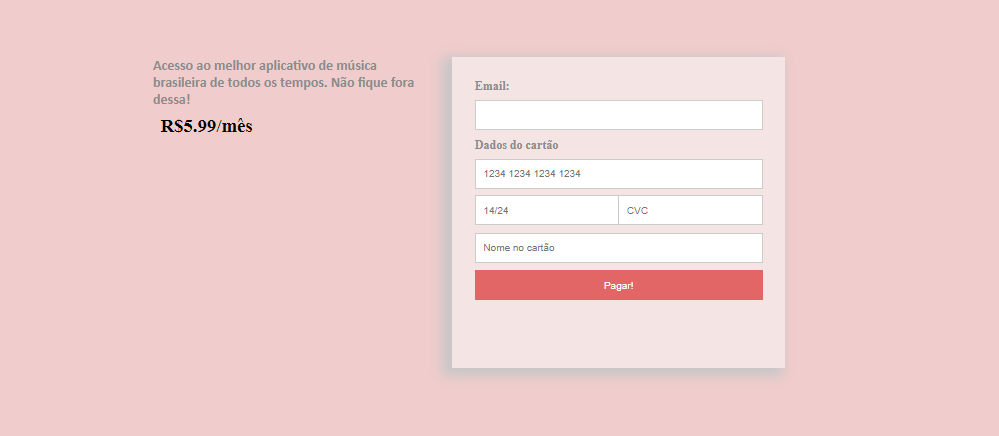

# Frontend Mentor - Order summary card

# Versão do Projeto Design para Aplicativo musial 

## Bem-vindo! 👋

Obrigada por conferir este desafio de codificação de front-end.

[Frontend Mentor](https://www.frontendmentor.io) Esse é um desafio para melhorar habilidades de codificação criando projetos realistas.

**No desafio do Frontend Mentor foi usado HTML e CSS.**

# Design para Aplicativo musial 

Através do desafio do Frontend Mentor, realizei uma nova versão onde foram feitas diversas alterações. Acrescentando uma `cor` e `background` com cores diferentes, além de um formulário de pagamento.

**Além de HTML e CSS, acrescentei Javascript.**

## O desafio

Construção de um componente do cartão de resumo do pedido  para parecer o mais próximo possível do design.

## Objetivo do Projeto

A ideia foi fazer o projeto do Frontend Mentor para treinar o uso do flexbox e responsividade: Realizei a alteração das cores do projeto original e a descrição, acrescentando uma nova página de formulário de pagamento responsivo e com adicão de uma nova funcionalidade com alerta Javascript.

## Sobre o Projeto

A tarefa foi construir o projeto para os designs dentro da pasta `/design`. Onde encontrei uma versão móvel e uma versão desktop do design.

Os desenhos estão em formato JPG estático. Usei meu julgamento para estilos como `font-size`, `padding` e `margin`.

Todos os recursos necessários estavam na pasta `/images`. 

No arquivo `style-guide.md` continham as informações necessárias, como paleta de cores e fontes. No entando, alterei as cores para dar outra cara ao projeto. 

## Construção do Projeto

1. Verificação dos designs para começar a planejar como lidar com o projeto. Etapa para pensar no futuro para criar classes CSS e estilos reutilizáveis. 
2. Estruturação do conteúdo com HTML para ajudar a focar atenção na criação de conteúdo bem estruturado.
3. Colocando os estilos básicos para o projeto, incluindo estilos de conteúdo gerais, como `font-family` e `font-size`.
4. Adição de estilos ao topo da página.
5. Criação da página principal.
6. Criação da página de formulário.
7. Utilização de flexbox para fins de treino prático. 
8. Criação de um alert com Javascript para o botão do index.html.
9. Criação de um alert com Javascript para o submit do formulário de pagamento. 

**Flexbox - Responsividade - Javascript** 🚀
